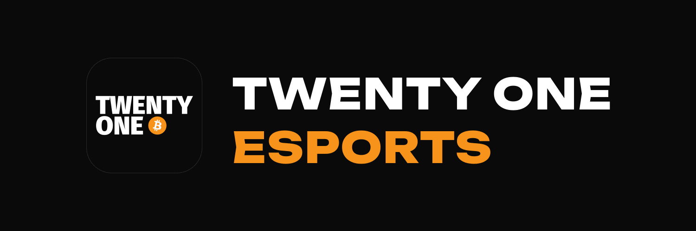

<p align="center">
  
</p>

# TWENTY ONE Esports

A ladder platform for Bitcoiners, built by the German-speaking Bitcoin community
[EINUNDZWANZIG](https://einundzwanzig.space). Players sign in with Nostr. The project
also runs a 24/7 livestream that is announced on Nostr as a NIP-53 live event.

> **Status:** work in progress. Live at <https://esports.einundzwanzig.space>.

## Stack

- **Backend:** PHP 8.3+, Laravel 13, Livewire 4, Flux UI (Pro), Laravel Reverb
- **Frontend:** Tailwind CSS 4, Vite
- **Nostr:** [`swentel/nostr-php`](https://github.com/nostrver-se/nostr-php) on the server, `nostr-tools` in the browser
- **Tests:** Pest 5, Larastan, Pint
- **Streaming:** ffmpeg writes HLS, nginx serves it

## Local setup

Flux Pro needs a license. Put your Composer credentials in `auth.json`; the file is
gitignored.

```bash
cp .env.example .env
composer install
php artisan key:generate
touch database/database.sqlite
php artisan migrate
npm ci
composer run dev
```

## Tests

```bash
vendor/bin/pest --parallel          # unit + feature
vendor/bin/pest --group=relay       # needs local Nostr relays (excluded by default)
vendor/bin/pint --format agent
vendor/bin/phpstan analyse --memory-limit=1G
```

## Contributing

Commit messages use [gitmoji](https://gitmoji.dev) (`✨ Add …`, `🐛 Fix …`). Open pull
requests against `master`.

## License

[MIT](LICENSE). Fonts and chess pieces used by the stream scene keep their own
licences, see [THIRD-PARTY-NOTICES.md](THIRD-PARTY-NOTICES.md).
